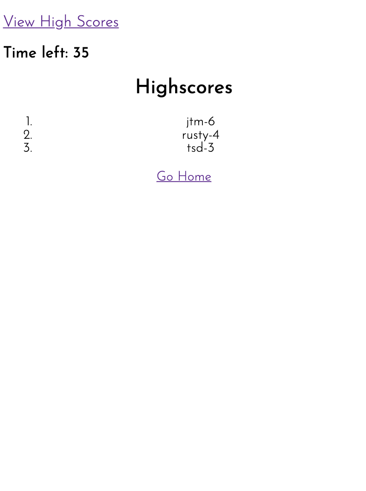
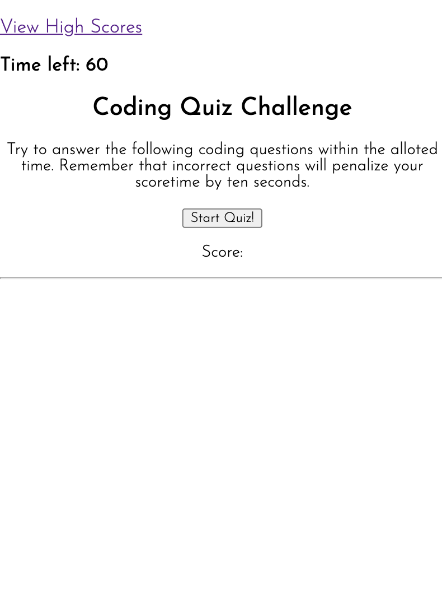

# codequiz
Assignment is to create a code related quiz with a timer and high score tracking using HTML, CSS and Javascript. A timer runs throughout
the duration of the quiz. When a question is answered incorrectly, the timer subtracts 10 seconds. At the end of the quiz, user is instructed
to type their initials into an input box which stores their most recent score in local storage and is then displayed on the high score page.

Link to Github repository: https://github.com/jordanmorse/codequiz
Link to website: https://jordanmorse.github.io/codequiz/

